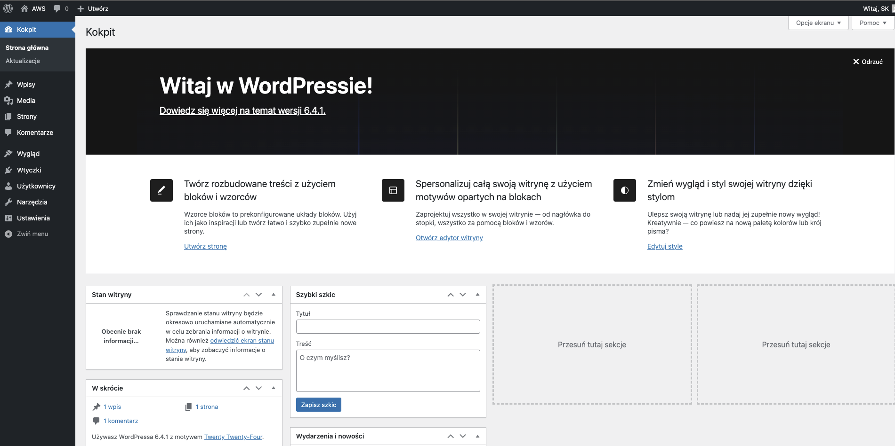

# Wordpress installation (Amazon Linux 2023)
* `https://docs.aws.amazon.com/AWSEC2/latest/UserGuide/hosting-wordpress-aml-2023.html`

1. `dnf install wget php-mysqlnd httpd php-fpm php-mysqli mariadb105-server php-json php php-devel -y`
2. `wget https://wordpress.org/latest.tar.gz`
3. `tar -xzf latest.tar.gz`
4. `sudo systemctl start mariadb httpd`
5. `mysql -u root`
6. `CREATE USER 'wordpress-user'@'localhost' IDENTIFIED BY 'uekcracow2023!@';`
7. `CREATE DATABASE `wordpress-db`;`
8. `GRANT ALL PRIVILEGES ON `wordpress-db`.* TO "wordpress-user"@"localhost";`
9. `FLUSH PRIVILEGES;`
10. `exit`

## open config
1. `cp wordpress/wp-config-sample.php wordpress/wp-config.php`
2. `nano wordpress/wp-config.php`
3. get salt from `https://api.wordpress.org/secret-key/1.1/salt/`
### config files:
```
define('DB_NAME', 'wordpress-db');
define('DB_USER', 'wordpress-user');
define('DB_PASSWORD', 'uekcracow2023!@');
define('AUTH_KEY',         '+]18JH4ftzB-/p%<6$[a-o+g/|ams;n!~&R,m:b40zF9u74TQ@d?!NyCqc,Jy^``');
define('SECURE_AUTH_KEY',  'ipM|P,zl(+{:a!|C.~B@<Q [c}VIc_hFcY7>vCy`#vR<}9MV`%M0T9@BNG(##?1D');
define('LOGGED_IN_KEY',    'NGUNx4T0~dELxmt@>A!knza0{i}2CN7sEvT$,}]sHh=Z-{WXxT(5S<vv:-nd1}Fk');
define('NONCE_KEY',        '^*.>@JUpW+r3lh.4?T5Ly/DiN8U_h&PMt:U/&tS1~td+DVOANtZ,g,pvfFV?7Y&Q');
define('AUTH_SALT',        'W}eEo$6~bg+p;:jz27nen~J9QdPJmKu%z>y-HMOH)l U;lNdm8wN`*CA +isHe0!');
define('SECURE_AUTH_SALT', 'At]H4ybG[nW1Z(B=p0S3 u+w:T<$]Nh*jd:r6os[v:1-+NWNb]L#DNfE%k4*?E(N');
define('LOGGED_IN_SALT',   './~&pzk}o_1K4+_<FO4cq9fKvF+G0f:(tPullJh@dMdi-iH?X~`!BH>q,2|=7f9!');
define('NONCE_SALT',       '?Y$X<DOphFW&F84i{+=_y(*i)./@PY6C]hnxVoN!.JYi+nyhAA@+h-3Xh7O_LojE');
```

* `ctrl+0` => `enter` => `ctrl+x`

#
1. `cp -r wordpress/* /var/www/html/`
2. `sudo nano /etc/httpd/conf/httpd.conf`
3. `AllowOverride All`
4. `sudo dnf install php-gd`
5. `sudo dnf list installed | grep php-gd`
6. `dnf list | grep php`
7. `sudo dnf install -y php8.1-gd`
8. `sudo chown -R apache /var/www`
9. `sudo chgrp -R apache /var/www`
10. `sudo chmod 2775 /var/www`
11. `find /var/www -type d -exec sudo chmod 2775 {} \;`
12. `find /var/www -type f -exec sudo chmod 0644 {} \;`
13. `sudo systemctl restart httpd`

## Start wordpress
1. `sudo systemctl enable httpd && sudo systemctl enable mariadb`

* Open wordpress in browser (using machine's ip)


